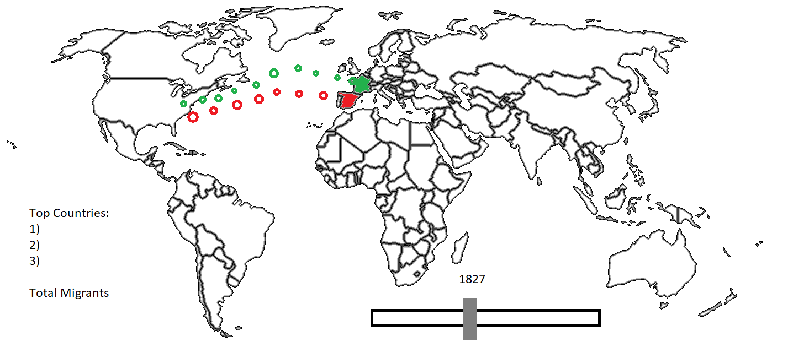

# term02_project01
## Team: J-HEM
### Team Members: Jonathan Quang, Henry Zheng, Edward Luo, Manahal Tabassum

#### Data Set(s) Used
[2013 Yearbook of Immigration Statistics from the Office of Immigration Statistics](http://metrocosm.com/wp-content/uploads/2016/05/usa-immigration-statistics-2013.pdf)

In this file, data regarding the number of people that have immigrated to the United States from the years of 1820 to 2013 by country is found. The table breaks down the years in increments of 10 and also gives a breakdown of immigration based on continent.

#### How will we use this data?
We will be creating a map which showcases immigration to the US from 1820 to 2013. Using circles that represent a certain amount of people, we will show them traveling from the origin country to the United States. The background of the site will be a map of the world. By doing this, users will able to see immigration trends into the US in terms of various countries. 

#### What will users see?
Users will see a map of the world in which dots are migrating from a country of origin on the page to the United States over time. Without user interaction, they will just continuously move across the screen going from 1820 to 2013. However, a slider will be available to users to move to a different year and a pause button will also be available in which users can temporarily pause the animation. 

#### Why do this?
This visualization will allow users to observe immigration trends. It helps to get a sense of which countries the majority of immigrants are from and during what years was immigration at its peak. We may implement a box to the side that showcases which three countries in a specific year sent the most immigrants which will allow us to see how these countries have changed over time. Likewise, it brings into perspective the changing demographics of the United States in response to this incoming of individuals from all around the world.

#### D3 Feature Utilization
We need to be able to build a map in which countries will change color in response to migrants from the nation. We can have different shades of colors to represent greater immigration. Likewise we will need D3 to showcase the movement of dots from one country to the United States. We will be utilizing it for animation purposes. 

#### Mockup

